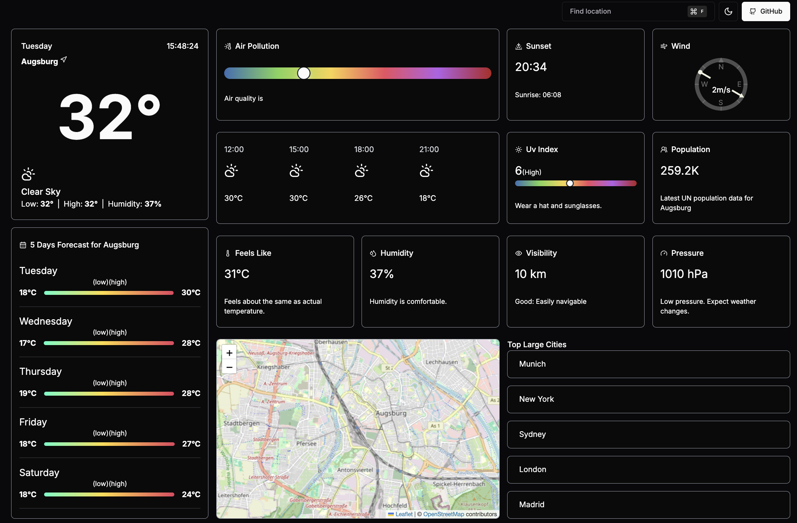

<h1 align="center">WeatherApp</h1>

Developed using [Next.js 14](https://nextjs.org/) with [`create-next-app`](https://github.com/vercel/next.js/tree/canary/packages/create-next-app), TypeScript, and Shadcn UI, this real-time weather app offers a seamless user experience. It presents all essential weather information in a beautifully designed, easy-to-navigate interface.

The live website can be found [here](https://weather-ilyhuxg89-patthoeges-projects.vercel.app/ ) 

## Table of Contents
+ [Features](#features "Features")
  + [Existing Features](#existing-features "Existing Features")
+ [Testing](#testing "Testing")
  + [Manual Testing](#manual-testing "Manual Testing")
  + [Validator Testing](#validator-testing "Validator Testing")
  + [Bugs](#bugs "Bugs")
  + [Unfixed Bugs](#unfixed-bugs "Unfixed Bugs")
+ [Technologies Used](#technologies-used "Technologies Used")
  + [Main Languages Used](#main-languages-used "Main Languages Used")
  + [Frameworks, Libraries & Programs Used](#frameworks-libraries-programs-used "Frameworks, Libraries & Programs Used")
+ [Components](#components "Components")
  + [Contexts](#contexts "Contexts")
  + [Hooks](#hooks "Hooks")
  + [Utils](#utils "Utils")
+ [Deployment](#deployment "Deployment")
  + [Deploying with Vercel](#deploying-with-vercel "Deploying with Vercel")
+ [Credits](#credits "Credits")
  + [Content](#content "Content")

## Features

### 1. **Current Weather Summary**
   - **Location and Date:** 
     - Displays the current city and the day of the week.
     - Shows the exact time.
   - **Temperature:**
     - Large, central temperature display.
   - **Weather Condition:**
     - Describes the current weather condition.
     - Additional details include the day's low and high temperatures Low | High and humidity.

### 2. **Air Pollution Indicator**
   - **Air Quality Gauge:**
     - Visual representation of air quality on a color-coded scale (with a pointer at the green/yellow range).
     - Text indicator below the gauge: "Air quality is".

### 3. **Sunset and Sunrise Times**
- Indicates the time of sunset and sunrise.

### 4. **Wind Speed and Direction**
   - **Wind Compass:**
     - Displays wind direction using a compass with labels (`N`, `S`, `E`, `W`).
     - Shows the wind speed and the direction.

### 5. **Hourly Temperature Forecast**
   - **Hourly Breakdown:**
     - A visual representation of the forecast at different times (`12:00`, `15:00`, `18:00`, `21:00`).
     - Temperature predictions for each hour.
### 6. **UV Index Gauge**
- A color-coded gauge showing the current UV index value.
- Suggests precautionary measures.

### 7. **Five Days Weather Forecast**
- Provides a brief forecast for the next five days.
- Each day displays a range for the expected low and high temperatures.

### 8. **Feels Like Temperature**
   - **Temperature Perception:**
     - Shows how the temperature feels like.
     - Text indicating it feels about the same as the actual temperature.

### 9. **Humidity Level**
   - **Humidity Indicator:**
     - Displays the current humidity level.
     - Notes that the humidity range.

### 10. **Visibility**
- Displays the visibility distance.
- Provides the visibility characteristis.

### 11. **Pressure**
- Displays the current pressure.
- Provides the pressure description.

### 12. **Population Data**
- Shows the latest UN population data for current location.

### 13. **Interactive Map**
- Displays an interactive map of the location, with zoom and pan capabilities.

### 14. **Top Large Cities**
- Displays a list of top large cities, presumably for quick access to their weather data: `Munich`, `New York`, `Sydney`, `London`, `Madrid`.

### 15. **UI Navigation and Tools**
- **Location Finder:**
    - A search bar to find specific locations for weather data.
- **Settings and Options:**
    - Buttons to toggle between Fahrenheit and Celsius (`F` and `C`), and access GitHub for source code or repository.

[Back to top](<#table-of-contents>)

## Testing

### Manual Testing

### Validator Testing

### Unfixed Bugs

### Bugs

| **Bug** | **Error** | **Issue** | **Solution** |
|---------|-----------|-----------|--------------|
| Command/Combobox TypeError and Unclickable/Disabled items | TypeError |  When utilizing a Command component, Items are unclickable and disabled | Pin cmdk version to 0.2.1 in package.json [GitHub Issue](https://github.com/shadcn-ui/ui/issues/2944) and leverage `ul` and `li` to list.  |
| ReferenceError: window is not defined | ReferenceError | Error encountered during build for React Leaflet | Refer to [StackOverflow Solution](https://stackoverflow.com/questions/77658930/having-referenceerror-window-is-not-defined-error-for-react-leaflet-during-buil/77664865#77664865) |
| Errors during the build process in Next.js | Build Error | API routes relying on dynamic data fail during static rendering. Examples: `Error fetching forecast data` and `Error in getting pollution data` | Use `export const dynamic = 'force-dynamic'` in API route files, it solves the build error |

[Back to top](<#table-of-contents>)

## Technologies Used

### Main Languages Used
- React
- Next.js
- Typescript
- Tailwind

### Frameworks, Libraries & Programs Used

- [next-themes](https://nextui.org/docs/customization/dark-mode#nextjs-app-directory-setup): comes with two default themes lightand dark
- [shadcn/ui](https://ui.shadcn.com/): a collection of re-usable components that supports React
- [Open Weather API](https://openweathermap.org/api): utilized to retrieve and display forecasted weather data
- [Lucide React](https://lucide.dev/guide/packages/lucide-react): icon library for react applications
- [Moment](https://www.npmjs.com/package/moment): to manipulate date and time
- [Axios](https://www.npmjs.com/package/axios): request and fetch data
- [lodash](https://www.npmjs.com/package/lodash): Geo search delay input changes

[Back to top](<#table-of-contents>)

## Components

Several components have been implemented within this project that have been reused throughout the project:

### Context
- **GlobalContext.js:** manages and shares global state across various components in the application. 
    - It defines several asynchronous functions (fetchForecast, fetchAirQuality, fetchFiveDaysForecast, fetchUvIndex) that use axios to fetch weather, air quality, five-day forecast, and UV index data based on geographic coordinates. 
    - The handleInput function updates the search bar's input value and triggers the fetching of geocode data. This function also uses a debounced effect to optimize the API requests, avoiding unnecessary calls when the user is typing. 
    - Contains useEffect hooks to fetch data whenever the active city coordinates (activeCityCoords) change, ensuring the app always displays the latest weather and environmental data.

### Provider
- **ThemeProvider:** is a custom provider that wraps the application with two essential context providers:
    - The `NextThemesProvider` is imported from the next-themes library, which manages theme switching (e.g., light and dark modes) in a Next.js application. By wrapping the application in NextThemesProvider, this component allows users to toggle between different themes and preserves the selected theme across sessions.
    - Inside the `NextThemesProvider`, the`GlobalContextProvider` (imported from GlobalContext.js) is used. This provides the global state and functions (like fetching weather data, handling input, etc.) to the entire application.

### Utils
- **defaultStates.tsx:** defines and exports an array of objects named defaultStates. This array serves as a default list of predefined locations with specific geographic information. 
- **Icons.tsx:** is a utility file that imports a collection of icons from the lucide-react library and exports them as React components with predefined sizes. This file makes it easier to manage and use icons consistently across the application.
- **misc.tsx:** contains a set of utility functions and data structures that are used throughout the application to perform common tasks related to temperature conversion, air quality description, date and time formatting, and number formatting. 

### API Routes
- fivedays
- geocode
- pollution
- uv
- weather

## Getting Started

##### Create App:
`npx create-next-app@latest weather-app`

#### Run App:
`npm run dev`

Open [http://localhost:3000](http://localhost:3000) with your browser to see the result.

## Deployment

### Deploy on Vercel

The easiest way to deploy your Next.js app is to use the [Vercel Platform](https://vercel.com/new?utm_medium=default-template&filter=next.js&utm_source=create-next-app&utm_campaign=create-next-app-readme) from the creators of Next.js.

Check out our [Next.js deployment documentation](https://nextjs.org/docs/deployment) for more details.

[Back to top](<#table-of-contents>)

## Credits

I follow [The Code Dealer FullStack Weather Application Tutorial](https://www.youtube.com/watch?v=rscl9VwwnQg&t=19970s) to learn more and build my first app using Next.js

Patricia Höge
